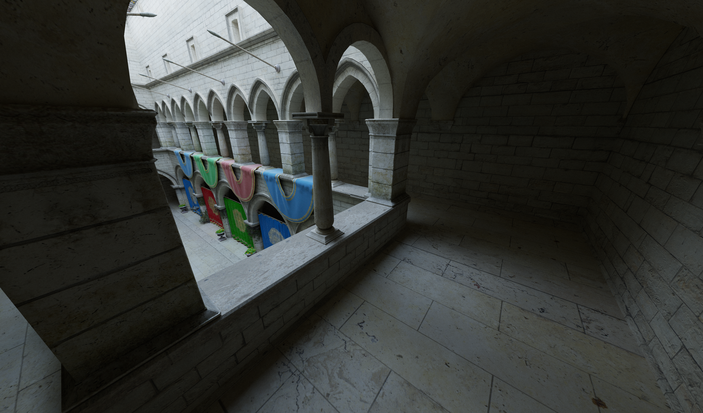
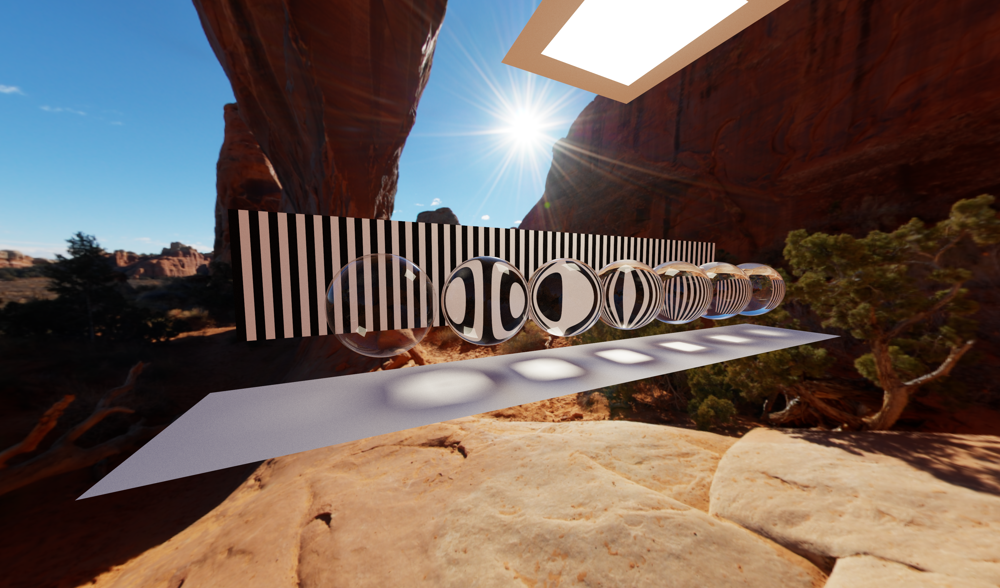
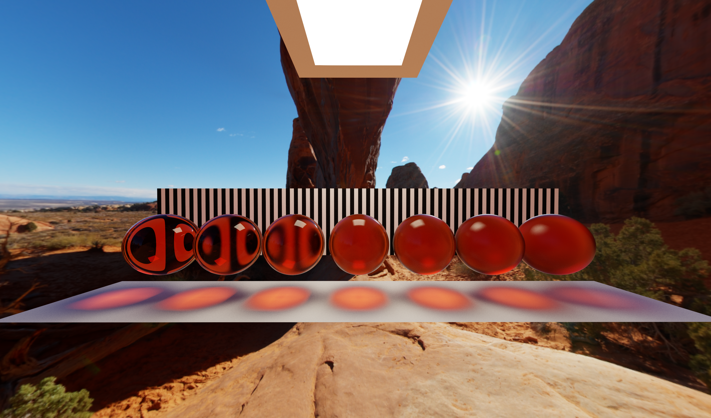
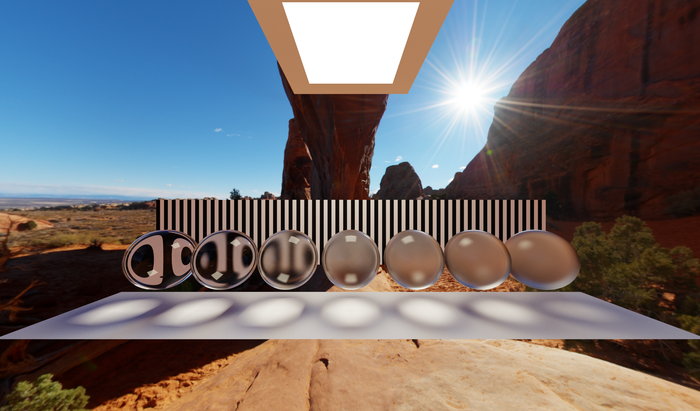
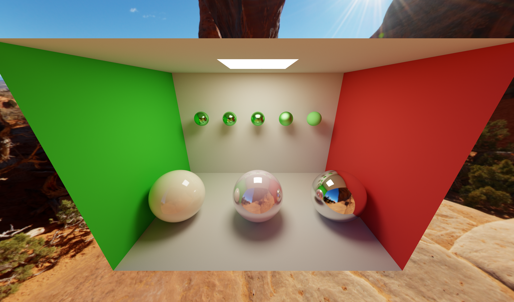
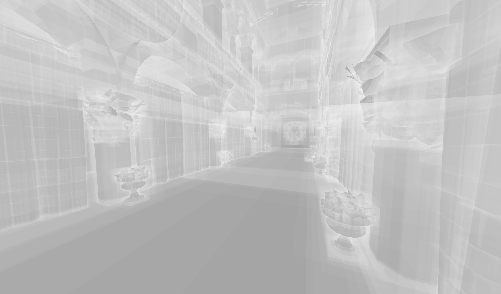
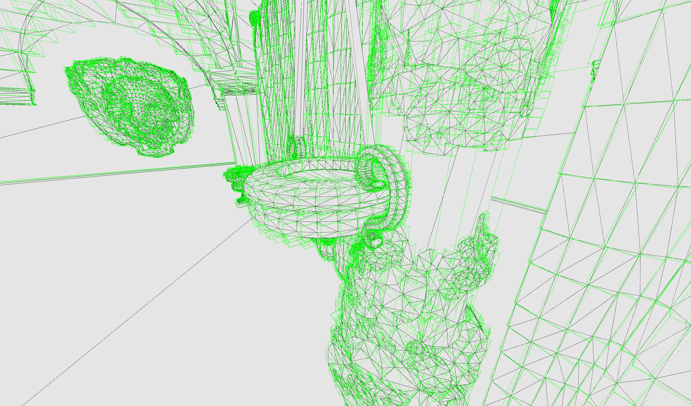

# Vulkan Path Tracer

## Overview

This project is a simple Vulkan-based path tracer written in C++ and GLSL. It features both software and hardware-accelerated ray tracing. The project started out with a focus on Bounding Volume Hierarchy (BVH) and how to build and use them to speed up ray tracing. 
The build process uses surface area heuristics (SAH) to determine the most efficient BVH for the scene.

## Current Features
- **Simple Path Tracing**: Simple non-physically based path tracing.
- **Russian Roulette**: Uses Russian roulette to speed up tracing and avoid paths that do not significantly contribute to the final result.
- **Software Ray Tracing**: Implements a triangle path tracer in compute shaders using a custom-built BVH and traversal.
- **Hardware Accelerated Ray Tracing**: Supports a hardware-accelerated path (using `VK_KHR_acceleration_structure` and `VK_KHR_ray_tracing_pipeline` Vulkan extensions).
- **BVH Construction**: Constructs a BVH using surface area heuristics (SAH).
- **Cross-Platform**: Can be run on both Windows and macOS.
- **Debug Views**: Contains various debug views such as normals, texcoords, albedo, barycentric coords etc. The software version also contains bvh-intersection debug-views and the ability to view the BVH

## Planned Features
- **Physically Based Light Model**: The current path tracer is very simple and is not necessarily physically based, even though things such as Fresnel are taken into account. However, a more physically accurate BRDF would improve the look.
- **Importance Sampling**: Generate more useful rays using importance sampling.
- **D3D12 Port**: Port to HLSL and D3D12.
- **Unified Code Paths**: Unify the software and hardware paths in order to reuse more code.

## Getting Started

### Prerequisites

Before you begin, ensure you have the following installed:

- Visual Studio 2022 or 2019 (for Windows), Xcode (for macOS)
- A compiler that support C++20 or later
- Vulkan SDK (1.3.250.1)

### Building the Project

1. **Clone the Repository**

    ```bash
    git clone -b Path-Tracer https://github.com/Mumsfilibaba/Vulkan-Project.git
    cd Vulkan-Project
    ```

2. **Update Dependencies**

    - For Windows:
        ```bash
        ./Update_Dependencies.bat
        ```

    - For macOS:
        ```bash
        ./Update_Dependencies.command
        ```

3. **Generate Project Files**

    - For Visual Studio 2022:
        ```bash
        ./Premake_VS2022.bat
        ```
    - For Visual Studio 2019:
        ```bash
        ./Premake_VS2019.bat
        ```
    - For Xcode:
        ```bash
        ./Premake_xcode.command
        ```

4. **Build and Run the Project**

    - Open the generated solution or workspace in Visual Studio (for Windows) or Xcode (for macOS).
    - Build and run the project from your chosen IDE.

## Screenshots













